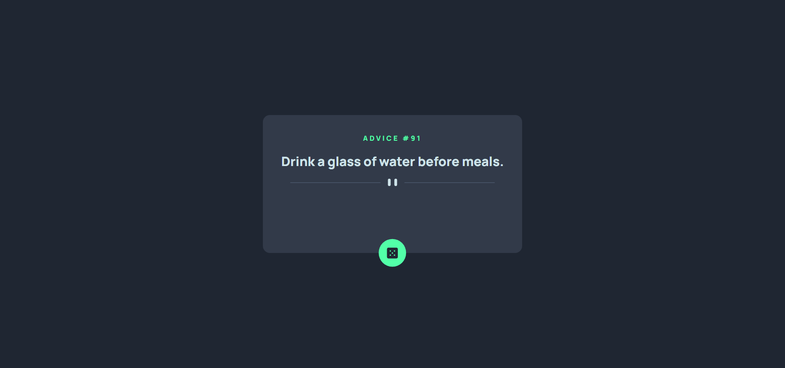

# Frontend Mentor - Advice generator app solution

This is a solution to the [Advice generator app challenge on Frontend Mentor](https://www.frontendmentor.io/challenges/advice-generator-app-QdUG-13db). Frontend Mentor challenges help you improve your coding skills by building realistic projects.

## Table of contents

- [Overview](#overview)
  - [The challenge](#the-challenge)
  - [Screenshot](#screenshot)
  - [Links](#links)
- [My process](#my-process)
  - [Built with](#built-with)
  - [What I learned](#what-i-learned)
  - [Continued development](#continued-development)
  - [Useful resources](#useful-resources)
- [Author](#author)


## Overview
  Advice Generator app 
### The challenge

Users should be able to:

- View the optimal layout for the app depending on their device's screen size
- See hover states for all interactive elements on the page
- Generate a new piece of advice by clicking the dice icon

### Screenshot




### Links

- Solution URL: [Add solution URL here](https://your-solution-url.com)
- Live Site URL: [Add live site URL here](https://your-live-site-url.com)

## My process

- firstly, I built the basic html template and then designed the page.
- Then, used javascript to fetch the quotes from the api
- Atlast, dynamically changed the quote and qoute id.

### Built with

- Semantic HTML5 markup
- CSS custom properties
- Flexbox
- CSS Grid


### What I learned

- The most difficult part during this project was to make the svg responsive.
- but, I came through that problem also
- During this project I got to learn that we can add media queries using javascript.

-- code snippet of making the svg responsive using javascript.

```js
const bigSvg = '<svg width="444" height="16" xmlns="http://www.w3.org/2000/svg"><g fill="none" fill-rule="evenodd"><path fill="#4F5D74" d="M0 8h196v1H0zM248 8h196v1H248z"/><g transform="translate(212)" fill="#CEE3E9"><rect width="6" height="16" rx="3"/><rect x="14" width="6" height="16" rx="3"/></g></g></svg>';

const smallSvg = '<svg width="295" height="16" xmlns="http://www.w3.org/2000/svg"><g fill="none" fill-rule="evenodd"><path fill="#4F5D74" d="M0 8h122v1H0zM173 8h122v1H173z"/><g transform="translate(138)" fill="#CEE3E9"><rect width="6" height="16" rx="3"/><rect x="14" width="6" height="16" rx="3"/></g></g></svg>';

const replace = document.getElementById('svgReplace');
const mediaQuery = window.matchMedia('(max-width:376px)');

mediaQuery.addEventListener('change',handleSvg);

function handleSvg(e){
    if (e.matches) {
        replace.innerHTML = smallSvg;
        // console.log('small');
    } else {
        replace.innerHTML = bigSvg;
        // console.log('big');
    }
}
handleSvg(mediaQuery);
```


### Continued development

- I  will learn more about making the pages responsive.
- How to effectively use media Queries.

### Useful resources

- [Css-tricks](https://css-tricks.com/working-with-javascript-media-queries/) - This helped me for implementing media queries using javascript .


## Author

- Website - [Mohd Wajahat]()
- Frontend Mentor - [@mohdwajahat](https://www.frontendmentor.io/profile/yourusername)
- Twitter - [@rehan6848](https://www.twitter.com/rehan6848)

